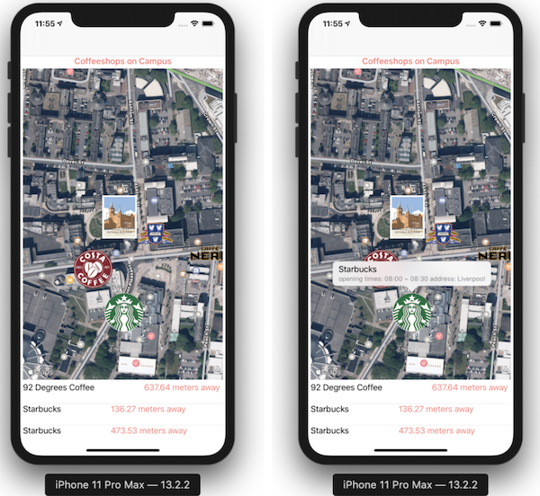
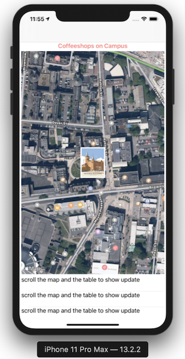

# Cafe Nearby
The application enable user to locate coffee-shops on campus.
The user is initially presented with a map centred on their basic location and at a reasonable level of
zoom so that nearby roads etc.
The map contains a number of annotation marks indicating the location of nearby coffee-shops

# Using Technology

Swift, API

# User Guide

When open the app, user is initially presented with a map centred on their current location and at a reasonable level of zoom so that nearby roads. The basic location is at the Ashton Building in University of Liverpool
(latitude: 53.406566, longitude: -2.966531)

From the beginning, The app displays interfaces :

  ● images : the app shows the different logos of cafe to make easily distinguish coffee
shops 

  ● annotations : when tapping the images on the map, player can get the simple
information of coffee shops such as opening hours or addresses. 

  ● distance : the table shows the distances of coffee shops from the current location.

If the image and distances are not displayed, simply zoom in or out the map or scroll the table to update the information from json decoding.

